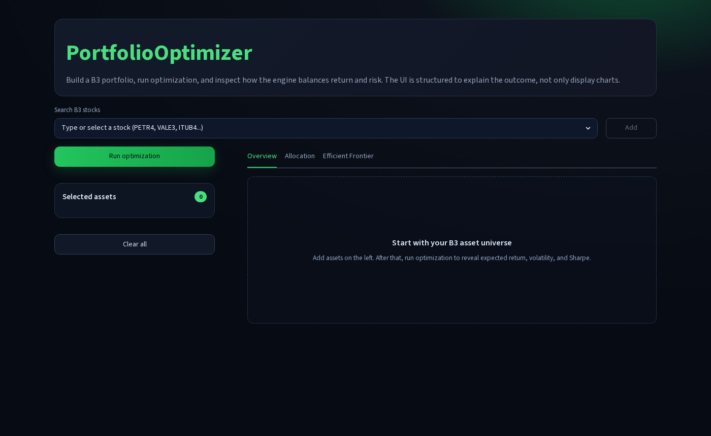
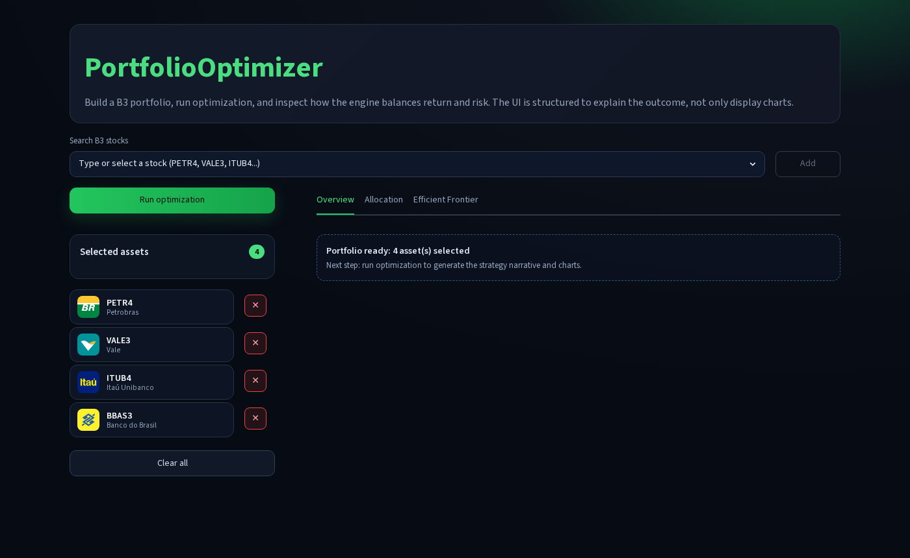
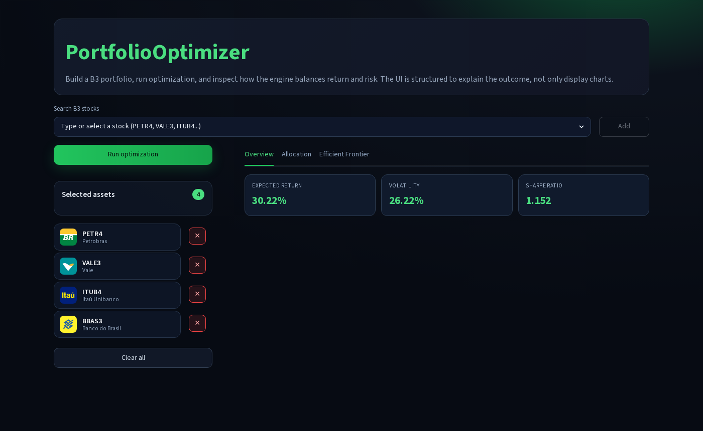
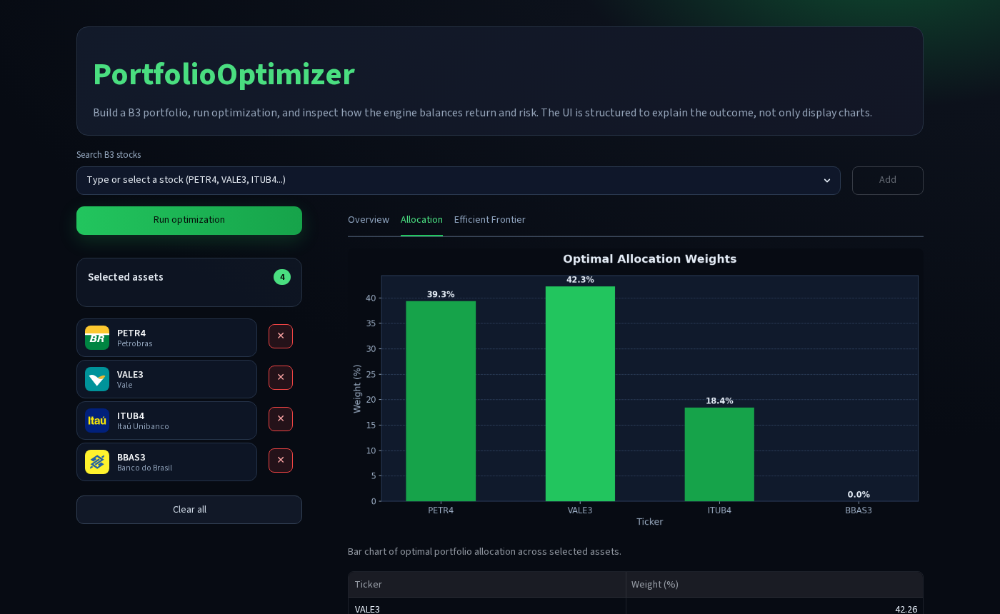
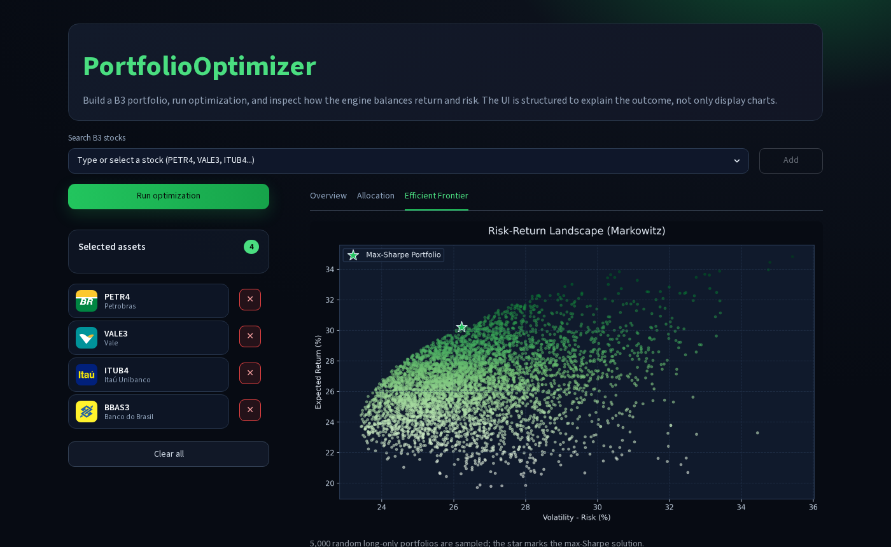

<div align="center">

# PortfolioOptimizer

A Streamlit web app that builds and optimizes B3 (Brazilian stock exchange) portfolios using Markowitz's Modern Portfolio Theory. Pick your assets, run the solver, and get the max-Sharpe allocation with an interactive risk-return landscape.


</div>

---

## Screenshots

**Empty state — pick your asset universe**



**Four assets selected, ready to optimize**



**Overview: expected return, volatility, and Sharpe ratio after optimization**



**Allocation tab: optimal weights as a bar chart and downloadable JSON**



**Efficient Frontier tab: 5 000 random portfolios, star = max-Sharpe solution**



---

## How it works

The engine fetches daily closing prices from Yahoo Finance via yFinance, computes log returns, then solves for the portfolio weights that maximize the Sharpe Ratio using SciPy's SLSQP constrained optimizer.

### Expected return

$$
E(R_p) = \sum_{i=1}^{n} w_i \mu_i
$$

### Portfolio volatility

$$
\sigma_p = \sqrt{w^\top \Sigma \, w}
$$

### Sharpe Ratio (risk-free rate = 0)

$$
SR = \frac{E(R_p)}{\sigma_p}
$$

### Optimization problem

$$
\max_{w} \; \frac{E(R_p)}{\sigma_p}
\quad \text{subject to} \quad
\sum_{i=1}^{n} w_i = 1, \quad w_i \geq 0
$$

---

## Project structure

```
PortfolioOptimizer/
├── main.py              # Streamlit UI
├── tickers.json         # B3 ticker list with display names
├── src/
│   ├── engine.py        # Orchestrates data fetch → optimize → plot
│   ├── data_loader.py   # yFinance download, price/weight persistence
│   ├── preprocessing.py # Log-return computation
│   ├── metrics_calc.py  # Portfolio return and volatility helpers
│   ├── optimization.py  # SLSQP max-Sharpe solver
│   ├── plot_weights.py  # Allocation bar chart
│   └── plotting_frontier.py  # Efficient frontier scatter
├── results/
│   ├── plots/           # Generated PNG charts
│   └── weights/         # Saved weights.json from last run
└── pyproject.toml
```

---

## Installation

Requires Python 3.13+ and [uv](https://docs.astral.sh/uv/).

```bash
git clone https://github.com/peucroccs/PortfolioOptimizer.git
cd PortfolioOptimizer
uv sync
```

If you prefer plain pip:

```bash
pip install -r requirements.txt   # or: pip install .
```

---

## Usage

```bash
uv run streamlit run main.py
```

Then open `http://localhost:8501` in your browser.

1. Search for B3 tickers in the dropdown (e.g. `PETR4`, `VALE3`, `ITUB4`).
2. Click **Add** for each asset you want in the portfolio (minimum 2).
3. Click **Run optimization**.
4. Inspect the three tabs: **Overview** for headline metrics, **Allocation** for the weight breakdown, and **Efficient Frontier** for the risk-return landscape.
5. Download the optimized weights as JSON from the Allocation tab.

---

## Tech stack

| Library | Role |
|---|---|
| [Streamlit](https://streamlit.io) | Web UI |
| [yFinance](https://github.com/ranaroussi/yfinance) | Market data |
| [SciPy](https://scipy.org) | SLSQP optimizer |
| [NumPy](https://numpy.org) | Matrix math |
| [Pandas](https://pandas.pydata.org) | Data wrangling |
| [Matplotlib](https://matplotlib.org) | Chart rendering |

---

## References

- Markowitz, H. (1952). *Portfolio Selection*. The Journal of Finance, 7(1), 77–91.
- Sharpe, W. F. (1966). *Mutual Fund Performance*. The Journal of Business, 39(1), 119–138.

---

## Authors

Raphael Quintanilha — [github.com/raphaelfq](https://github.com/raphaelfq)

Peter Croccer — [github.com/peucroccs](https://github.com/peucroccs)
